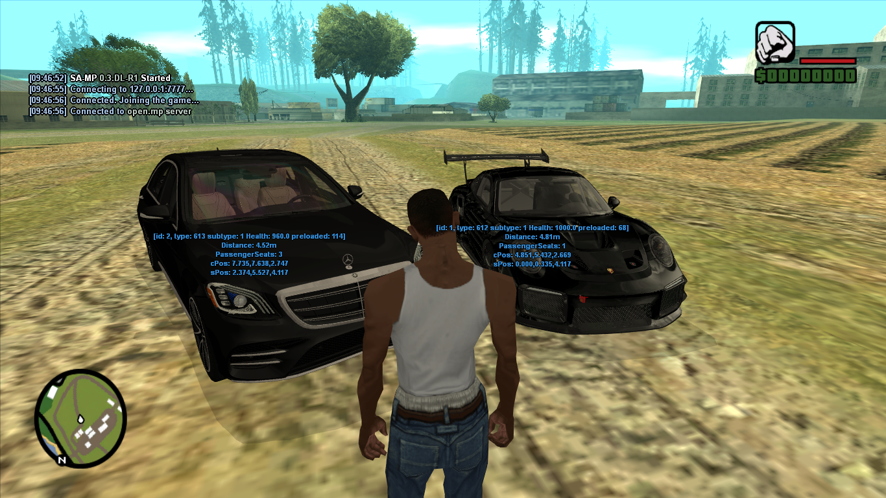

# OpenSAA
A rewritten version of OpenSAA based on the original GitLab project, adding SA-MP 0.3.DL support and vehicle model limit expansion.

# Original repository:
https://gitlab.com/prime-hack/samp/plugins/OpenSaa/-/tree/master
# Requirements

Before using OpenSAA, make sure you have:

- GTA San Andreas 1.0 US
- SA-MP 0.3.DL
- ASI Loader
- Fastman92 Limit Adjuster
# Example
Example of OpenSAA running on open.mp server with the SA-MP 0.3.DL client and expanded vehicle model limits.

